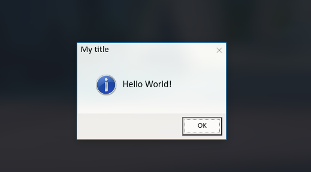

# WindowsMessageBox.js

Create Windows-like 🪟 message boxes 💬 for your website



# jsDelivr

```html
<script src="https://cdn.jsdelivr.net/gh/SkwalExe/WindowsMessageBox.js@v0.4.1/dist/windowsMessageBox.min.js"></script>
```
# NPM module 

Install the npm module 

```bash
npm install windowsmessagebox
```

And import it in your project 

```js
const MessageBox = require('windowsmessagebox');
```

**⚠️ You will need to bundle the package with your application (for example with browserify) because this library only works in the browser**

```bash
browserify index.js -o bundle.js
```

# Setting up 

You can import the library into you website with [JsDelivr](#JsDelivr) or, you can use the [npm module](#NPM-module) and import it in your project.

**You also need to import the css file to your website**

```html
<link rel="stylesheet" href="https://cdn.jsdelivr.net/npm/windowsmessagebox@0.4.1/dist/wmsgbox.min.css">
```

# Warning 🚨

Versions below `v0.3.0` contains a lot of errors and are not properly working, consider using `v0.3.0` or higher, the function names are the same and you don't need to change your code.

# Example

This repo provides a simple example of usage of the library : `example.html`

Double click on the page to open a message box

# Usage 📝

This library provides one function : `windowsMessageBox.show()`
  
# windowsMessageBox.show()

This function creates a message box.

It takes 5 parameters:

- [`title`: The title of the message box.](#title--message)
- [`message`: The message of the message box.](#title--message)
- [`type`: The type of the message box, can be](#type)
- [`buttons`: The buttons of the message box](#buttons)
- [`position`: The position of the message box](#position)

It returns a promise that resolves when the user clicks on a button/closes the message box.

## Example 📝

### **Title & Message**

The title will be displayed in the top of the message box and the message will be displayed in the middle of the message box.

```js
windowsMessageBox.show("This is my title!", "This is my message!");
```


### **Type**

The type defines the icon and the sound of the message box.

- `"info"`
- `"error"`
- `"warning"`

**Type -> `info`**

```js
windowsMessageBox.show("This is my title!", "This is an information message!", "info");
```


**Type -> `warning`**

```js
windowsMessageBox.show("This is my title!", "This is a warning message!", "warning");
```


**Type -> `error`**

```js
windowsMessageBox.show("This is my title!", "This is an error message!", "error");
```


### **Buttons**

This parameter defines the buttons of the message box.

**Example**

```js
let buttons = [
    ["Yes"],
    ["No"]
]

let clicked  = windowsMessageBox.show("This is my title!", "This is my message!", "info", buttons);

console.log(clicked); // "Yes" if the user clicked on the "Yes" button, "No" if the user clicked on the "No" button
```


You can also define the value returned depending on the button clicked.

If we want the button `hello` to return `true` and the button `world` to return `false`, we can do it like this:

```js
let buttons = [
    ["hello", true],
    ["world", false]
]
```

### **Position**

This parameter defines the position of the message box.

It can be: 

- [`x`, `y`] : pop up the message box at the given position
- `"random"` : pop up the message box at a random position on the page

# final

If you have any problem, don't hesitate to open an issue

# contributing

1. Start by [**forking** this repository](https://github.com/SkwalExe/windowsMessageBox.js/fork)

2. Then clone your fork to your local machine.
  ```git
  git clone https://github.com/your-username/windowsMessageBox.js.git
  ```

3. Install dev dependencies
  ```npm
  npm install --save-dev
   ```

4. Create a new branch
  ```git
  git checkout -b super-cool-feature
  ```

5. Then make your changes

6. Update the changelog and version number if needed (using [Semantic Versioning](https://semver.org)) also, update the version number in the JsDelivr links (js and css)
  ```bash
  # bug fix
  npm version patch --no-git-tag-version

  # add a new feature 
  npm version minor --no-git-tag-version
  
  # changes that break backwards compatibility
  npm version major --no-git-tag-version
  ```

7. List and correct linting errors
  ```bash
  npm run lint
  ```

8. Update the minified/browser version of the library
  ```bash
  npm run build
  ```

9. Once you're done, commit your changes and push them to the remote repository.
  ```git
  git add --all
  git commit -m "Add super-cool-feature"
  git push origin super-cool-feature
  ```

10. Then, open a pull request on GitHub from your fork.
   1. Go to [this link](https://github.com/SkwalExe/windowsMessageBox.js/compare/)
   2. Click compare across forks
   3. On the right, on `head repository` select your fork
   4. And on `compare` select the branch you just created
   5. Click on `Create Pull Request` and submit your pull request

<a href="https://github.com/SkwalExe#ukraine"></a>